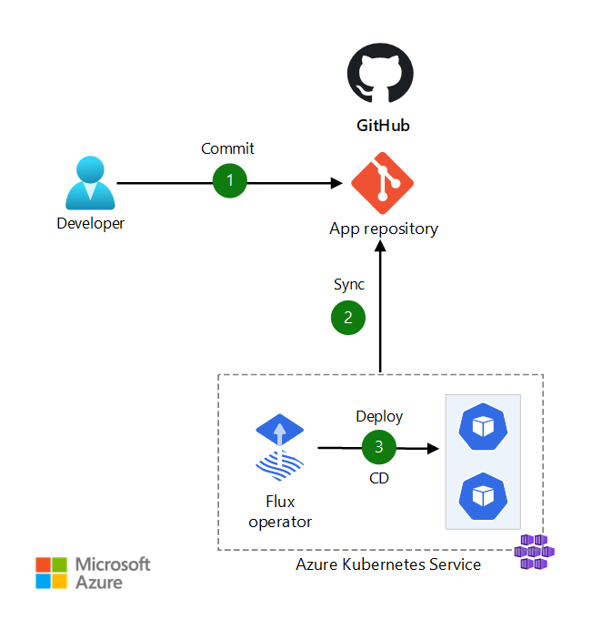

# About this project


## Flow



## Usage

### Create the base infrastructure 

This will create the following resources:
- A Vnet for the AKS cluster
- An AKS cluster with the managed FluxCD extension enabled
- A "Workload" Resource Group were the TF-controller will deploy its resources

This steps expects that a resource group named ```aks-gitops``` already exists in your subscription.

```
$ az login
$ cd base/infra
$ terraform init
$ export ARM_SUBSCRIPTION_ID=$(az account show --query id -o tsv)
$ terraform plan
$ terraform apply
```
> azurerm_role_assignment.workload-rg might fail due to Entra ID's replication delay, if that's the case, please try plan/apply again.

### Check if the Flux componentes are running

```
$ az aks get-credentials --name aks-gitops --resource-group aks-gitops
$ kubectl -n flux-system get pods
```

### Add Flux GitOps Configurations

This step will:
- Create a namespace where Flux's configs will be deployed into
- Configure the flux-applier service account that is going to be used to apply every resource from now on
- Configure a Kustomize config that is going to deploy TF-controller
- Configure a Kustomize config that is going to deploy Azure Resources
- Configure a Kustomize config that is going to deploy the application resources

TF-controller configuration
```
$ az k8s-configuration flux create -g aks-gitops -c aks-gitops -n cluster-config --namespace cluster-config -t managedClusters --scope cluster -u https://github.com/underguiz/aks-gitops --branch main --kustomization name=tf-controller path=cluster-config/tf-controller
```

Azure Resources configuration
```
$ az k8s-configuration flux create -g aks-gitops -c aks-gitops -n cluster-config --namespace cluster-config -t managedClusters --scope cluster -u https://github.com/underguiz/aks-gitops --branch main --kustomization name=azure-resources path=cluster-config/azure-resources
```

## Reference docs

https://learn.microsoft.com/en-us/azure/azure-arc/kubernetes/tutorial-use-gitops-flux2?tabs=azure-cli
https://fluxcd.io/flux/components/source/gitrepositories/
https://fluxcd.io/flux/guides/helmreleases/
https://flux-iac.github.io/tofu-controller/getting_started/